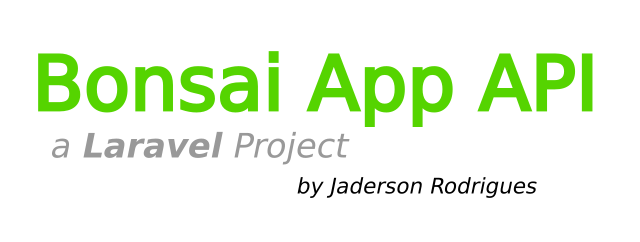

## About the Project

The Bonsai App was created with two main goals: Support bonsaists in general to catalogue and store historical data about their bonsai items in suitable, safier and more inteligent fashion, as well as provide material to develop a real-life project for github.com/Jadersonrilidios developed by Jaderson Rodrigues. See the author [github profile](https://github.com/Jadersonrilidio).

The **API documentation** is available at [API Documentation](https://bonsai-app.herokuapp.com/api/documentation).

## Installation and Local Environment Setup

Follow below the steps to setup and run the application at a local environment.

Clone the github repository to your local machine with the command:

    $ git clone https://github.com/Jadersonrilidio/bonsai-app

Update and download all necessary PHP/Laravel dependencies with composer:

    $ composer update

Update and download all necessary frontend dependencies with npm package manager:

    $ npm install
    $ npm run dev

Create and edit the .env file Database variables (It is recommended to configure a mysql database with the following setups):

    DB_CONNECTION=mysql
    DB_HOST=127.0.0.1
    DB_PORT=3306
    DB_USERNAME=root
    DB_PASSWORD=

For a sqlite3 database, create a file at the root folder of the project with the command:

    $ touch ./database/database.sqlite

Set and configure all other environment variables for JWT token and API Documentation as shown bellow:

    JWT_SECRET=
    JWT_TTL=360
    JWT_REFRESH_TTL=20160

    L5_SWAGGER_TITLE='API Documentation'
    L5_SWAGGER_USE_ABSOLUTE_PATH=
    L5_FORMAT_TO_USE_FOR_DOCS=json
    L5_SWAGGER_CONST_HOST=http://localhost
    L5_SWAGGER_DOC_NAME_JSON='api-docs.json'

After configured the database and environment variables, run the migrations with the command:

    $ php artisan migrate

Finally, use the command below to run the application:

    $ php artisan serve

You also have the option to run the database seed command to populate the database with default plant_classifications, bonsai_styles and intervention_classification items:

    $ php artisan db:seed

Or run a specific database seed command as:

    $ php artisan db:seed PlantClassificationSeeder
    $ php artisan db:seed BonsaiStyleSeeder
    $ php artisan db:seed InterventionClassificationSeeder

Also you can run updates made in the Vue frontend by using the commands:

    $ npm run dev
    $ npm run watch
    $ npm run prod (for production)

## Contributing

Thank you for considering contributing to the Transaction API Project! For contributing, please send an e-mail to Jaderson Rodrigues [contato@jadersonrodrigues.com](contato@jadersonrodrigues.com).

## Security Vulnerabilities

If you discover any security vulnerability within the project, please send an e-mail to please send an e-mail to Jaderson Rodrigues [contato@jadersonrodrigues.com](contato@jadersonrodrigues.com).